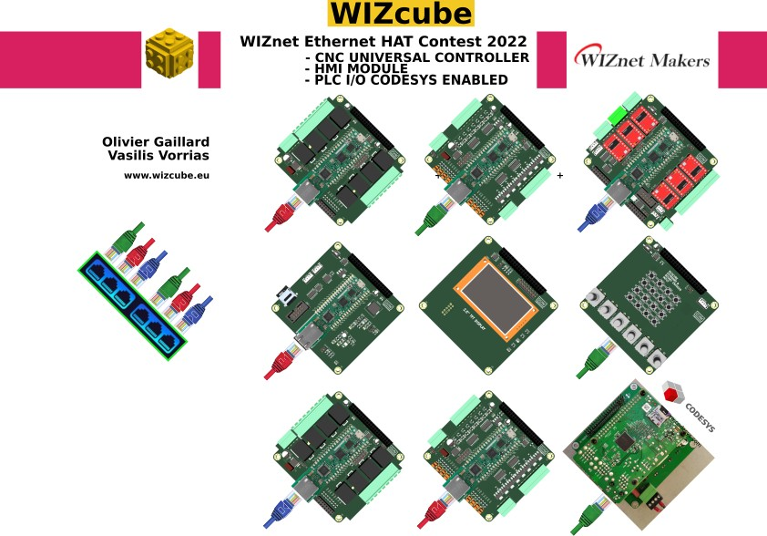

23/02/2022
After a long time working endless hours on our WIZcube project and see it submitted to WIZnet contest.
Two Makers, totally strangers between them  one in Greece me and other in Denmark Olivier Gaillard teamed to go for the WIZnet contest and submit the idea before closing.
https://maker.wiznet.io/wiznet-ethernet-hat-contest/

We shared the same dream to build something different. Something to be useful to the community as being OSHW project.
It is a huge project and we must finish everything until the end of March.
During the building period it will be more info on our web www.wizcube.eu

This project moved to <a href="http://gitlab.com/m10cube/m10">GitLAB</a>

And <a href="https://hackaday.io/project/171770-m10cube">HACKADAY</a>

M10CUBE is a Practical Form Factor Ecosystem. It is the idea of a micro controller cube 10x10x10 cm.
SCOPE:
A control block to be used like a Lego "brick" to solve any control problems. Definitely a job for micro controllers.A smart design to be used as PLC or IOT device for Industry 4.0 and M2M deployments.
FIELD OF APPLICATIONS:
PLC, IOT, Education, Home Automation, Light Industrial Applications
PCBs, Schematics (Eagle and KiCAD), 3D enclosures and software are in constant developing.
Applications will keep coming so to encourage everyone to get involved and to use the M10CUBE out of the box

License

Verification code  GR000004
Licensed under the  CERN OHL P 2.0 
Software License: GPL v3
Documentation License: CC BY 4.0 International

More on <a href="https://github.com/M10CUBE/M10/wiki">wiki</a> section

