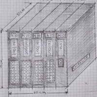
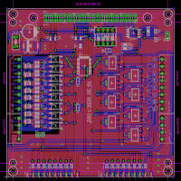
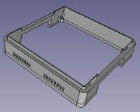
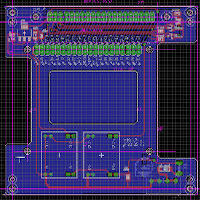
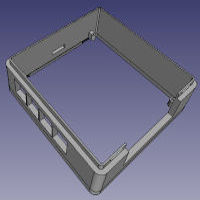
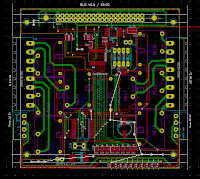

  
     

M10 ecosystem is a community project and is the idea of a micro controller cube 10x10x10 cm. It is a hardware agnostic cube.
In practice only one rule must fulfilled for us to say that this is an M10 device and that is:

- External enclosure (CUBE) maximum dimensions X = 10cm, Y = 10cm, Z = Up to 10cm .
There are some sub rules but everyone can build his own incarnation of M10. The idea is every M10 incarnation to be able to recognize its brother M10
That is because for us re usability is the key for our M10 idea.
To start thinking M10 we will introduce you our first M10 PLC incarnation which at the time of writing (05/05/2020)
has the following modules ready for fabrication. 

1 – CPU module (contains Raspberry Pi 4). All modules share the same 40pin Raspberry bus powered by 24V.

2 – DIO module. Eight opto isolated 24V inputs plus eight 24V outputs high side transistors.

3 – DO module. Eight relays with 16 amps contact capability to power any heavy loads even 220V mains power appliances.

The idea for first M10 is to have the very popular Raspberry 4 module. All modules can plugged in as HAT using the 40 pin connector. So many can benefit right away.

The team is preparing...
– AIO module.  That is 10V analog input and output
- SNS module. That is a sensor board capable of monitoring the air for pollution
- Multi M10-CPU PCB in place of Raspberry 4 with STM32F103 + ESP8266 +...
- Ideas are keep coming and not necessary all are going to the drawing board but we will have fun in the process

What applications can are suitable for M10 ecosystem? Well nearly everything. To name a few:
- PLC controller ever expandable with IEC 61131-3 programming
- Home Automation controller as a Master with, Node-RED, openHAB, Home Assistant, Python etc or as slave device for mains switching, sensor reading, with TASMOTA or any custom hardware
- Motor control
- Environmental sensor reading for Air Quality monitoring.
- LORAWAN
- Industrial IoT applications
- Drone controller
- Greenhouse controller
- Bulglar alarm controller
- NAS or a set top box for your TV

Of cource there are limits lke everything in life but you can build almost everything. Have the idea and make the board. The new PCB will be will be part of the M10-CUBE family and will be used from everybody.
settings/profile

All depends on the modules you choose to plug in and your imagination to find applications that make sense.

Used materials out of the self. DIY friendly. Think Green philosophy
Soon we will publish the M10 road map plus PCBs, electronic circuits (Eagle and KiCAD) and 3D enclosures
Applications and software will follow so to encourage everyone to get involved
