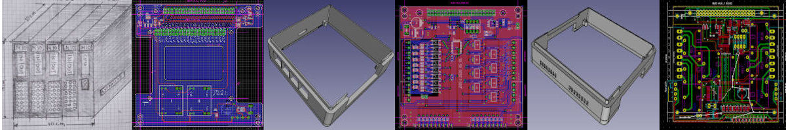

M10-CUBE community project is a Practical Form Factor Ecosystem. It is the idea of a micro controller cube 10x10x10 cm. It is a hardware agnostic cube.

Only one rule must fulfilled to say that this is an M10CUBE device:
- External enclosure (CUBE) maximum dimensions X = 10cm, Y = 10cm, Z = Up to 10cm .  Powered by 24 DC or Battery or POE or AC (220/110).

Some sub rules must also apply but it is to verify that every M10-CUBE incarnation can communicate and stand side by side with the other.

Directives:

- Used materials and modules out of the self if possible. 
- DIY friendly. 
- Think Green and Reuse philosophy

PCBs, Schematics (Eagle and KiCAD), 3D enclosures and software are in constant developing.
Applications will keep coming so to encourage everyone to get involved and to use the M10CUBE out of the box

More on <a href="https://github.com/M10CUBE/M10/wiki">wiki</a> section

This project moved to http://gitlab.com/m10cube/m10

